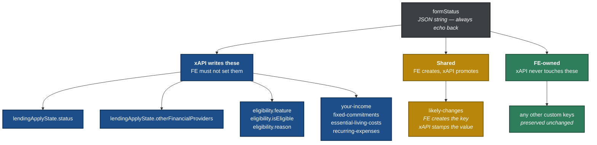
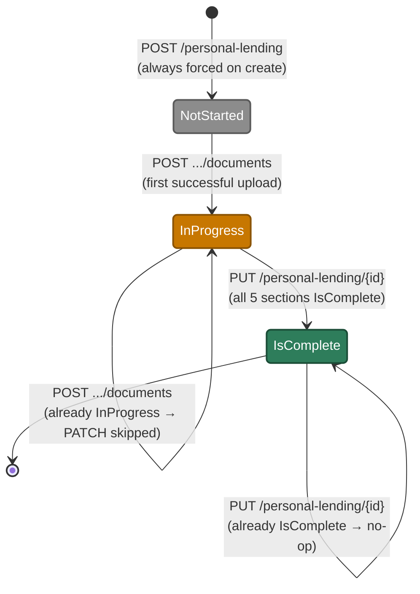
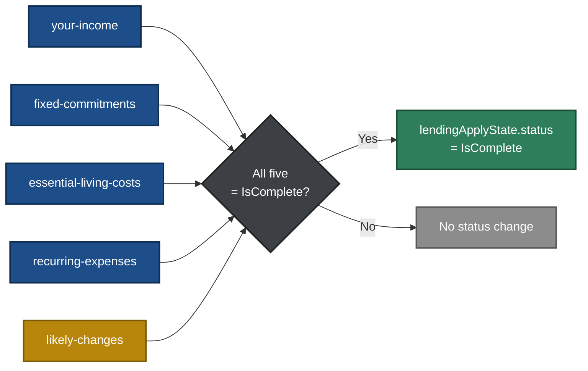
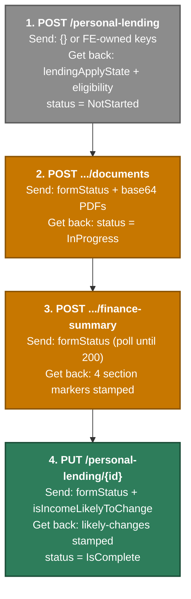

# formStatus — the frontend guide

**Audience:** Frontend engineers integrating with the Personal Lending xAPI (`xapi-wone-customer-offer`).
**Scope:** How the `formStatus` value changes across the income and expenses journey, and what the frontend is responsible for.

---

## 1. Read this first — the six rules

If nothing else on this page sticks, these do.

| # | Rule | Why it matters |
|---|------|----------------|
| 1 | **Always echo back the `formStatus` returned by the last response.** Never rebuild it from scratch after the initial POST. | The blob carries keys the xAPI wrote and keys other screens wrote. Rebuilding it silently drops them. |
| 2 | **The frontend must never set `lendingApplyState.status`.** | The xAPI owns that transition. A value sent by the frontend is overwritten or ignored. |
| 3 | **The frontend must create the `likely-changes` key** (for example `"likely-changes": "NotStarted"`) before the customer reaches that screen. | The xAPI promotes this key to `"IsComplete"`, but it will not create it. If the key is missing, the journey can never complete. |
| 4 | **Absent is not the same as null** on optional PUT fields. Omit a field entirely if it should not change. | Sending `null` may clear the value downstream. |
| 5 | **The response always carries the persisted `formStatus`.** Use it as the source of truth. | No follow-up GET is needed after any mutating call. |
| 6 | **One request can cascade.** Supplying `isIncomeLikelyToChange` on PUT can stamp `likely-changes` *and* complete the whole journey in a single call. | Do not assume one call equals one state change. |

---

## 2. What `formStatus` actually is

`formStatus` is an **opaque, double-encoded JSON string** that the frontend round-trips on every request. The xAPI reads it, mutates a small set of known keys, and writes it back. Every other key the frontend puts in there is preserved untouched.

Think of it as a bag the frontend carries through the journey. The xAPI reaches into the bag and changes six things. Everything else in the bag belongs to the frontend.

### Key ownership



| Owner | Keys | Rule |
|-------|------|------|
| **xAPI** | `lendingApplyState.*`, `eligibility`, the four finance-summary section markers | xAPI writes these. The frontend must not set them manually. |
| **Frontend** | `likely-changes` (creation only), any other custom keys | Frontend creates and sets the values. The xAPI preserves them. |
| **Shared** | `likely-changes` (the value) | Frontend creates the key with an initial value such as `"NotStarted"`. The xAPI promotes it to `"IsComplete"` when `isIncomeLikelyToChange` is supplied on PUT. |

### Full shape

A `formStatus` blob mid-journey, decoded and pretty-printed. On the wire this is a single escaped string inside the request or response body — see §5 for the escaped form.

```json
{
  "lendingApplyState": {
    "status": "InProgress",
    "otherFinancialProviders": true
  },
  "eligibility": {
    "feature": "INCOME_AND_EXPENSES",
    "isEligible": true
  },
  "your-income": "IsComplete",
  "fixed-commitments": "IsComplete",
  "essential-living-costs": "IsComplete",
  "recurring-expenses": "IsComplete",
  "likely-changes": "NotStarted",
  "anyKeyOfYourOwn": "preserved untouched"
}
```

### Key reference

| Key | Type / values | Written by | When |
|---|---|---|---|
| `lendingApplyState.status` | `"NotStarted"` \| `"InProgress"` \| `"IsComplete"` | xAPI | Create, first document upload, and the PUT completion cascade |
| `lendingApplyState.otherFinancialProviders` | `true` \| `false` | xAPI | PUT, folded in from the `otherFinancialProviders` request field |
| `eligibility.feature` | `"INCOME_AND_EXPENSES"` | xAPI | Create, always |
| `eligibility.isEligible` | `true` \| `false` | xAPI | Create, derived from `isJointApplication` |
| `eligibility.reason` | `"JOINT_APPLICANT"` | xAPI | Create, only when `isEligible` is `false` |
| `your-income` | `"IsComplete"` | xAPI | `finance-summary`, on a successful categorised report |
| `fixed-commitments` | `"IsComplete"` | xAPI | `finance-summary`, on a successful categorised report |
| `essential-living-costs` | `"IsComplete"` | xAPI | `finance-summary`, on a successful categorised report |
| `recurring-expenses` | `"IsComplete"` | xAPI | `finance-summary`, on a successful categorised report |
| `likely-changes` | FE's initial value, then `"IsComplete"` | **Frontend creates**, xAPI promotes | FE: before the income-change screen. xAPI: on PUT when `isIncomeLikelyToChange` is supplied |
| *any other key* | Anything | Frontend | Never read or modified by the xAPI |

> `lendingApplyState` may gain further xAPI-owned fields later. Treat the whole object as xAPI territory rather than enumerating what is in it today.

---

## 3. The journey lifecycle

Three states, and the xAPI decides all three.



### Wire values

These are the exact strings in the JSON. They are case sensitive.

| State | Wire code |
|-------|-----------|
| Not started | `"NotStarted"` |
| In progress | `"InProgress"` |
| Complete | `"IsComplete"` |

---

## 4. The completion gate — five markers

`lendingApplyState.status` can only become `"IsComplete"` when **all five** of these top-level keys exist **and** equal `"IsComplete"`.



| Section marker key | Stamped by | When |
|---|---|---|
| `your-income` | xAPI (finance-summary) | Successful categorised report |
| `fixed-commitments` | xAPI (finance-summary) | Successful categorised report |
| `essential-living-costs` | xAPI (finance-summary) | Successful categorised report |
| `recurring-expenses` | xAPI (finance-summary) | Successful categorised report |
| `likely-changes` | **Frontend creates** / xAPI auto-stamps | Frontend sends the key; the xAPI stamps `"IsComplete"` when `isIncomeLikelyToChange` is supplied on PUT |

> **The most common integration bug lives in this table.** Four of the five markers appear on their own. The fifth does not — if the frontend never creates `likely-changes`, the gate never opens and the journey never completes, with no error to explain why.

---

## 5. Walkthrough — one journey, call by call

This is the happy path. Watch the `formStatus` grow.



### Step 1 — Create the application

**Before** (what the frontend sends)

```json
{ "formStatus": "{}" }
```

**After** (what comes back)

<!-- VERIFY: paste the real enriched formStatus string from a POST response -->

```json
{
  "formStatus": "{\"lendingApplyState\":{\"status\":\"NotStarted\"},\"eligibility\":{\"feature\":\"INCOME_AND_EXPENSES\",\"isEligible\":true}}"
}
```

**What changed:** `lendingApplyState.status` forced to `"NotStarted"`, `eligibility` block added.

> **Do this now:** the frontend adds its own `"likely-changes": "NotStarted"` key to the blob before the customer reaches the income-change screen.

### Step 2 — Upload documents

**Before:** the blob from step 1, plus the FE-created `likely-changes` key.

**After**

<!-- VERIFY: paste the real formStatus string from a documents POST response -->

**What changed:** `lendingApplyState.status` moved `"NotStarted"` → `"InProgress"`. If the status was already `"InProgress"`, nothing changes and no downstream PATCH is made.

### Step 3 — Poll the categorised report

**After a 200**

<!-- VERIFY: paste the real formStatus string from a finance-summary 200 response -->

**What changed:** four section markers stamped to `"IsComplete"` — `your-income`, `fixed-commitments`, `essential-living-costs`, `recurring-expenses`. Status is still `"InProgress"` because `likely-changes` is not stamped yet.

### Step 4 — Answer "is your income likely to change?"

This is the cascade. One request, three mutations.

**Request**

```json
{
  "data": {
    "formStatus": "{\"lendingApplyState\":{\"status\":\"InProgress\"},\"your-income\":\"IsComplete\",\"fixed-commitments\":\"IsComplete\",\"essential-living-costs\":\"IsComplete\",\"recurring-expenses\":\"IsComplete\",\"likely-changes\":\"NotStarted\"}",
    "isIncomeLikelyToChange": true,
    "income": ["..."],
    "fixedCommitments": ["..."],
    "recurringExpenses": ["..."],
    "essentialLivingCosts": ["..."]
  }
}
```

**What the xAPI does, in order**

1. `otherFinancialProviders` not supplied → skip.
2. `isIncomeLikelyToChange` supplied **and** `likely-changes` is present but not `"IsComplete"` → stamp `likely-changes` = `"IsComplete"`.
3. All five sections are now `"IsComplete"` → set `lendingApplyState.status` = `"IsComplete"`.
4. PATCH downstream with the final `formStatus`, all catalogues, and `isIncomeLikelyToChange: true`.

**Response**

```json
{
  "data": {
    "formStatus": "{\"lendingApplyState\":{\"status\":\"IsComplete\"},\"your-income\":\"IsComplete\",\"fixed-commitments\":\"IsComplete\",\"essential-living-costs\":\"IsComplete\",\"recurring-expenses\":\"IsComplete\",\"likely-changes\":\"IsComplete\"}"
  }
}
```

**Result:** journey completed in a single request.

---

## 6. Endpoint reference

### 6.1 Quick reference — what do I need to send?

| Endpoint | `formStatus` required? | Other required fields | What comes back |
|---|---|---|---|
| `POST /personal-lending` | Optional (can be `{}`) | `isJointApplication` | Enriched `formStatus` with `lendingApplyState` + `eligibility` |
| `POST .../documents` | Mandatory | `files[]` (base64 PDFs) | Updated `formStatus` (status may change to `InProgress`) |
| `POST .../finance-summary` | Mandatory | — | Updated `formStatus` (4 sections stamped) + report data |
| `PUT /personal-lending/{id}` | Mandatory | — (all else optional) | Updated `formStatus` (possibly cascaded to `IsComplete`) |

### 6.2 `POST /v1/customer-offer/personal-lending` — start application

| What the xAPI does to `formStatus` | Always / Conditional |
|---|---|
| Forces `lendingApplyState.status = "NotStarted"` | Always, even if the frontend sends a different value |
| Sets `eligibility.feature = "INCOME_AND_EXPENSES"` | Always |
| Sets `eligibility.isEligible` based on `isJointApplication` | Always |
| Preserves all other frontend-supplied keys | Always |

**Frontend action:** send the initial `formStatus` blob. It can be `{}`. The response echoes the enriched version.

### 6.3 `POST /v1/customer-offer/personal-lending/{id}/documents` — upload documents

| Condition | What happens to `formStatus` |
|---|---|
| `lendingApplyState.status` is **not** `"InProgress"` | Sets status to `"InProgress"`, then PATCHes downstream |
| `lendingApplyState.status` is **already** `"InProgress"` | No PATCH. Echoes the incoming `formStatus` unchanged |

**Frontend action:** always send `formStatus` in the request body. The response echoes the possibly updated value.

### 6.4 `POST /v1/customer-offer/personal-lending/{id}/finance-summary` — poll categorised report

| Condition | What happens to `formStatus` |
|---|---|
| Downstream report succeeds | Stamps four section markers to `"IsComplete"`: `your-income`, `fixed-commitments`, `essential-living-costs`, `recurring-expenses`. PATCHes if any changed |
| Downstream report not ready (503) | No mutation. Returns 503 with a `Retry-After` header |
| Downstream report fails | No mutation. Error propagated |

**Frontend action:** poll until a 200 is returned. The response carries the updated `formStatus` with the four sections stamped.

### 6.5 `PUT /v1/customer-offer/personal-lending/{id}` — update application

The most complex endpoint. Several independent mutations can cascade in a single request.

**Mutation order, executed top to bottom in one call:**

```text
Step 1: Fold otherFinancialProviders (if supplied)
        → sets lendingApplyState.otherFinancialProviders

Step 2: Auto-stamp likely-changes (if conditions met)
        → sets likely-changes = "IsComplete"

Step 3: Check all-five-sections-complete
        → sets lendingApplyState.status = "IsComplete"

Step 4: Build downstream PATCH with formStatus + supplied fields
        (income, recurringExpenses, fixedCommitments,
         essentialLivingCosts, isIncomeLikelyToChange)
```

**Detailed decision table**

| # | Condition (what the frontend sends) | `formStatus` mutation | Downstream field |
|---|---|---|---|
| 1 | `otherFinancialProviders` is present | `lendingApplyState.otherFinancialProviders` = the supplied value | Not sent as its own field. Lives inside `formStatus` only |
| 2 | `isIncomeLikelyToChange` present **AND** `likely-changes` key exists in `formStatus` **AND** `likely-changes` ≠ `"IsComplete"` | `likely-changes` = `"IsComplete"` | `isIncomeLikelyToChange` = supplied value |
| 3 | `isIncomeLikelyToChange` present **AND** `likely-changes` key **absent** from `formStatus` | No mutation to `likely-changes` | `isIncomeLikelyToChange` = supplied value |
| 4 | `isIncomeLikelyToChange` present **AND** `likely-changes` already = `"IsComplete"` | No mutation (idempotent) | `isIncomeLikelyToChange` = supplied value |
| 5 | `isIncomeLikelyToChange` **absent** from request | No mutation to `likely-changes` | Not sent downstream |
| 6 | After steps 1–2: all five section markers = `"IsComplete"` | `lendingApplyState.status` = `"IsComplete"` | — |
| 7 | After steps 1–2: **not** all five sections complete | No status change | — |
| 8 | `lendingApplyState.status` already = `"IsComplete"` when step 6 triggers | No-op (idempotent) | — |

> **Row 3 is the trap.** Supplying `isIncomeLikelyToChange` when `likely-changes` does not exist in `formStatus` is silently accepted. The value goes downstream, but the marker is never created, so the completion gate stays shut. See rule 3.

---

## 7. Troubleshooting — why is my status stuck?

| Symptom | Most likely cause | Fix |
|---|---|---|
| All screens done, status still `"InProgress"` | `likely-changes` key was never created by the frontend (decision table row 3) | Create `"likely-changes": "NotStarted"` in `formStatus` before the income-change screen |
| Status never left `"NotStarted"` | No successful document upload yet | The transition happens on the first successful `POST .../documents` |
| Section markers never appear | `finance-summary` is returning 503 | Keep polling. Honour the `Retry-After` header |
| A custom key I set has vanished | `formStatus` was rebuilt instead of echoed | Always send back the exact string from the last response |
| `otherFinancialProviders` not visible downstream | It is not a downstream field | It lives inside `formStatus` only. Read it from `lendingApplyState` |
| A field I did not want to change came back empty | `null` was sent instead of omitting the field | Absent is not null. Omit the key entirely |
| Second document upload produced no change | Status was already `"InProgress"` | Expected. The PATCH is skipped by design |
| Repeated PUT after completion changes nothing | Status already `"IsComplete"` | Expected. Rows 4 and 8 are idempotent |

---

## 8. Verification checklist

<!-- Internal. Remove before publishing to Confluence, or keep in the repo copy only. -->

Points to confirm against `FormStatusProcessor`, `FormStatusProcessorTest`, `PersonalLendingApplicationService` and `schemas.yaml` before this page is treated as authoritative:

1. **Endpoint path spelling.** This page uses `finance-summary`. The sequence diagram uses `finances-summary` in at least one place. Confirm which is live.
2. **Case sensitivity of wire values.** The sequence diagram notes show `inProgress` and `isComplete` in places, against `"InProgress"` and `"IsComplete"` here. Confirm the exact casing the processor writes and compares.
3. **Decision table coverage.** Each of the eight rows in §6.5 should map to a test in `FormStatusProcessorTest`. List any row with no test, and any test with no row.
4. **Payload placeholders.** Sections 5.1 to 5.3 contain `<!-- VERIFY -->` markers. Replace the illustrative JSON with real strings captured from responses or test fixtures.
5. **`eligibility.reason`.** Confirm it is written only when `isEligible` is false, and that `"JOINT_APPLICANT"` is the only value.
6. **DELETE documents.** `DELETE .../documents/{documentId}` appears in the sequence diagram with no `formStatus` mutation shown. Confirm it genuinely leaves `formStatus` untouched, and add a row to §6.1 if it does not.
7. **`otherFinancialProviders` type.** Confirmed boolean in the anatomy tree. Check the schema agrees.

---

## Publishing notes

- **Mermaid in Confluence.** The diagrams need a Mermaid macro or app on the Confluence instance. If one is not available, render them to SVG or PNG and attach the images instead, keeping the Mermaid source in a collapsed code block underneath so the diagrams stay editable.
- **Source of truth.** Keep this file in the repo alongside `FormStatusProcessor`. Treat the Confluence page as a published copy, and re-publish from here rather than editing in place. The decision table in §6.5 is the part most likely to drift.
- **Suggested Confluence structure.** Section 1 as an info panel at the top, sections 6 and 7 inside expand macros, everything else on the page. Use status lozenges for `NotStarted` (grey), `InProgress` (yellow) and `IsComplete` (green) wherever the states appear in prose.
